# Portfolio
## Sobre mí
¡Bienvenido/a a mi página en github!

Mi nombre es Samuel Ríos, aunque la mayoría me conoce como "Thund3r", y soy programador de videojuegos.

## Algunos de mis proyectos
En esta sección puedes ver algunos de mis juegos, los cuales también puedes encontrar y probar en [mi perfil de itch.io](https://thund3rdev.itch.io/).

### 21 Singularity
21 Singularity es un juego multijugador local asimétrico para 3 jugadores con vista lateral, en el que 2 de los jugadores toman el rol de androides que deberán cooperar para salir de la fábrica, mientras que el tercer jugador será el malvado científico que tratará de impedirlo.

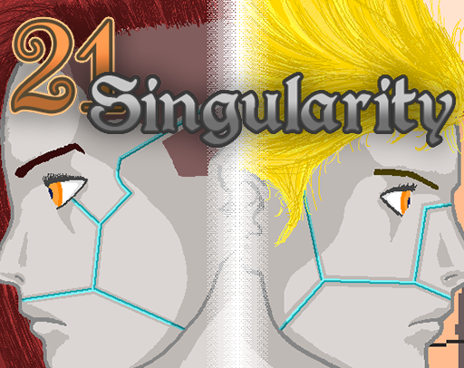

Fue un proyecto universitario de 4 personas para la asignatura "Juegos en Red", en la que teníamos que hacer una versión local (publicada) y otra versión que funcionase en red local.

Las partes de las que me encargué fueron:
- Implementación de los escenarios.
- Creación e implementación de obstáculos.
- Peticiones a un servidor mediante API REST para las salas (no en el producto publicado).
- Testing y corrección de bugs.

#### Imágenes del juego
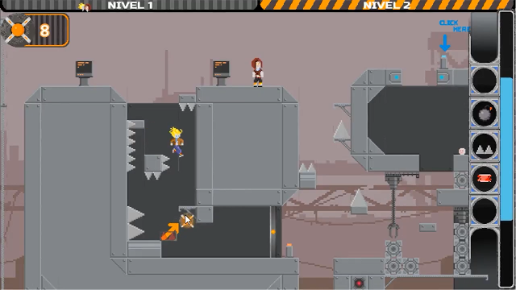
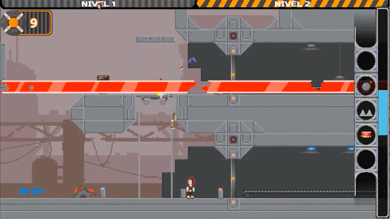
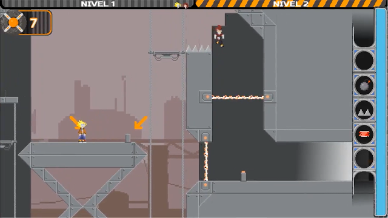

[Puedes probarlo aquí.](https://nanateam.itch.io/21-singularity)

* * *

### Dance Kingdom
Dance Kingdom es un juego de estratégica musical donde tendrás que seguir el ritmo para obtener oro que te permita formar y mandar tropas a la pista de batalla.

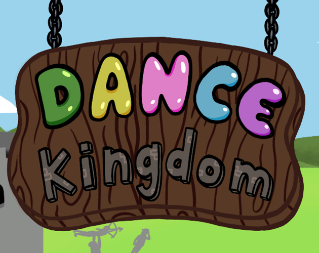

Este también fue un proyecto universitario, en este caso de 3 personas para la asignatura "Interacción Persona Máquina y Usabilidad", donde se nos pedía hacer un juego teniendo en cuenta principios de accesibilidad para que fuera jugable por la mayoría de personas posible, y además principios de usabilidad para facilitar y acomodar la experiencia del usuario.

En este proyecto, trabajé con 2 artistas, por lo que toda la programación está hecha por mí.

Como dato interesante, el proyecto se trabajó y realizó con una manta de baile como controlador (el juego leía los inputs de la manta de baile para su funcionamiento), pero para que pudiese ser jugado por más personas, decidimos publicarlo como juego para teclado. _¡Aunque siempre puedes hacer un remapeado local!_

#### Imágenes del juego
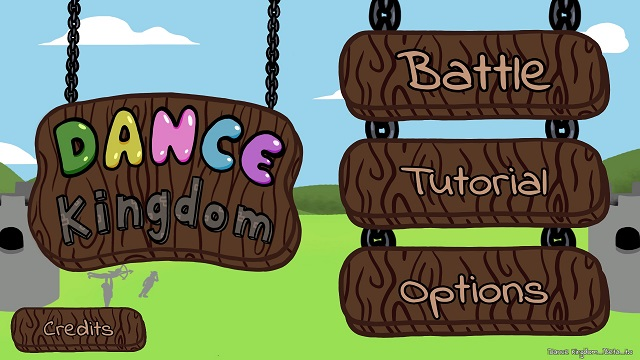
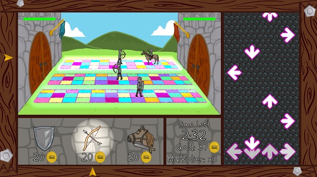

[Puedes probarlo aquí.](https://thund3rdev.itch.io/dance-kingdom)

* * *

### The Bat Mafia
Como participación para la #KenneyJam2020, con tema "Cursed", un compañero y yo decidimos hacer "The Bat Mafia". Un videojuego arcade con vista cenital en el que llevas un bate de béisbol que intentará acabar con las personas a tu alrededor. Debes avanzar acabando con la mafia del bate, ¡pero evita a los ciudadanos!

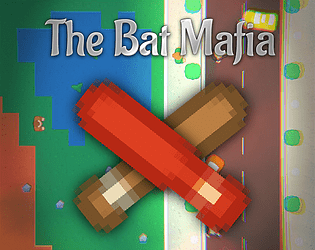

La Game Jam era de tan solo 48 horas, así que nos dividimos el trabajo lo mejor posible, y mis partes fueron las siguientes:
- Diseño e implementación del mapa mediante tiles.
- Controlador del personaje jugable.
- Diseño de nivel (posición de enemigos, aliados y obstáculos).
- Implementación del sonido.
- Iluminación.
- Post-procesado.
- Testing.

#### Imágenes del juego
<p align="center">
  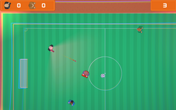
  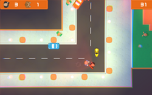
  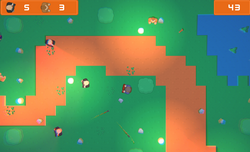
</p>

[Puedes probarlo aquí.](https://thund3rdev.itch.io/the-bat-mafia)

* * *

### Battle Of Villages
Este es mi proyecto personal, no está acabado aún, de hecho está en una fase bastante temprana de su desarrollo, pero quiero ir haciéndolo poco a poco.

Battle of Villages es un juego de cartas multijugador online 1v1 para móviles donde existen tres aldeas enfrentadas (Karma, Trueno y Energía Vital) que luchan por hacerse con el territorio sagrado situado entre estas.

En Battle of Villages los combates se realizan automáticamente de izquierda a derecha, de manera que los jugadores solo deben jugar la carta que deseen llamar a la batalla, de manera simultánea. Este es uno de los principios en los que se basa el juego, ya que la idea es que sea simple y accesible para todos, de manera que pueda gustarle a jugadores novatos y a jugadores experimentados en el género de cartas.

#### Preview del prototipo


## Contacto
Si quieres contactar conmigo, puedes hacerlo por:
- Correo electrónico: [samuelriosdev@gmail.com](mailto:samuelriosdev@gmail.com).
- LinkedIn: [Mi perfil de LinkedIn](https://www.linkedin.com/in/samuel-r%C3%ADos-ba51661a3/).

<!---
Text can be **bold**, _italic_, or ~~strikethrough~~.

[Link to another page](./another-page.html).

There should be whitespace between paragraphs.

There should be whitespace between paragraphs. We recommend including a README, or a file with information about your project.

# Header 1

This is a normal paragraph following a header. GitHub is a code hosting platform for version control and collaboration. It lets you and others work together on projects from anywhere.

## Header 2

> This is a blockquote following a header.
>
> When something is important enough, you do it even if the odds are not in your favor.

### Header 3

```js
// Javascript code with syntax highlighting.
var fun = function lang(l) {
  dateformat.i18n = require('./lang/' + l)
  return true;
}
```

```ruby
# Ruby code with syntax highlighting
GitHubPages::Dependencies.gems.each do |gem, version|
  s.add_dependency(gem, "= #{version}")
end
```

#### Header 4

*   This is an unordered list following a header.
*   This is an unordered list following a header.
*   This is an unordered list following a header.

##### Header 5

1.  This is an ordered list following a header.
2.  This is an ordered list following a header.
3.  This is an ordered list following a header.

###### Header 6

| head1        | head two          | three |
|:-------------|:------------------|:------|
| ok           | good swedish fish | nice  |
| out of stock | good and plenty   | nice  |
| ok           | good `oreos`      | hmm   |
| ok           | good `zoute` drop | yumm  |

### There's a horizontal rule below this.

* * *

### Here is an unordered list:

*   Item foo
*   Item bar
*   Item baz
*   Item zip

### And an ordered list:

1.  Item one
1.  Item two
1.  Item three
1.  Item four

### And a nested list:

- level 1 item
  - level 2 item
  - level 2 item
    - level 3 item
    - level 3 item
- level 1 item
  - level 2 item
  - level 2 item
  - level 2 item
- level 1 item
  - level 2 item
  - level 2 item
- level 1 item

### Small image


### Large image


### Definition lists can be used with HTML syntax.

<dl>
<dt>Name</dt>
<dd>Godzilla</dd>
<dt>Born</dt>
<dd>1952</dd>
<dt>Birthplace</dt>
<dd>Japan</dd>
<dt>Color</dt>
<dd>Green</dd>
</dl>

```
Long, single-line code blocks should not wrap. They should horizontally scroll if they are too long. This line should be long enough to demonstrate this.
```

```
The final element.
```
-->